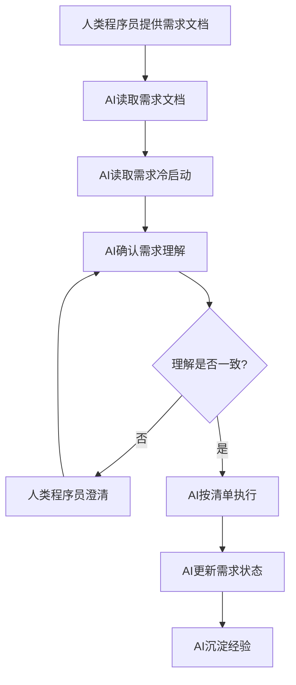

# 需求管理准则

> **版本**: v1.0
> **生效日期**: 2026-02-11
> **适用范围**: 所有产品需求、技术需求

---

## 一、术语定义与歧义澄清

> ⚠️ **重要**：本文档中出现的"等级"一词根据上下文有不同含义，必须严格区分：

| 术语 | 上下文 | 含义 | 取值范围 | 使用场景 |
|------|--------|------|---------|---------|
| **需求优先级** | 需求管理 | 需求是否实现的优先级 | P0/P1/P2 | 需求排期、资源分配 |
| **健康等级** | 体检报告 | 整体健康状况分类 | 健康态/需关注/需重视/需急诊 | overall_conclusion节点输出 |
| **异常等级** | 指标判定 | 单个指标的风险程度 | 无风险/低风险/中风险/高风险 | 指标分级判定 |
| **复查紧急度** | 检查建议 | 复查时间间隔 | 12月/6月/3月/1月 | further_check_recommendation节点输出 |

### 等级对应关系（四四对应）

| 健康等级 | 异常等级 | 复查紧急度 | 判定标准 |
|---------|---------|-----------|---------|
| 健康态 | 无风险 | 12个月 | 无任何异常指标 |
| 需关注 | 低风险 | 6个月 | 1个轻度异常，或超参考值但未达200% |
| 需重视 | 中风险 | 3个月 | 2个及以上中度异常，或超参考值200%以上 |
| 需急诊 | 高风险 | 1个月 | 危急值、生命威胁、急性病变 |

---

## 二、目录管理规范

### 2.1 目录结构

``` text
app-demand/
├── requirementsGuidelines.md      # 本文件（全局规范）
├── YYYY-MM-DD/                    # 按日期倒序排列
│   └── 需求名称/                  # 需求目录（驼峰命名）
│       ├── 需求文档.md             # 主文档【必须】
│       ├── 需求冷启动.md           # 需求级冷启动【必须】
│       ├── 产品/                  # 产品相关资料
│       │   ├── 产品需求.md
│       │   └── 原型图.png
│       ├── 设计/                  # 设计相关资料
│       │   └── 架构图.md
│       ├── 测试/                  # 测试相关资料
│       │   └── 测试问题.md
│       └── 代码/                  # 代码链接（完成阶段补充）
│           └── 代码映射.md
└── archive/                       # 归档目录
    └── YYYY-MM-DD/
        └── 需求名称/
```

### 2.2 目录优先级

1. **一级目录（日期）**：按创建日期倒序，便于快速定位最新需求
2. **二级目录（需求名称）**：使用驼峰命名，如`报告解读优化`、`支付流程改造`
3. **三级目录（类型）**：固定为`产品/设计/测试/代码`，不可随意新增

---

## 三、文档格式规范

### 3.1 文档头部元数据（必须）

``` yaml
---
需求名称: [简明扼要，20字以内]
需求编号: REQ-YYYYMMDD-NNN      # 如 REQ-20250210-001
需求类型: [产品需求/技术需求]      # ⚠️ 产品需求优先级高于技术需求
优先级: [P0/P1/P2]              # 见下文优先级定义
状态: [待评审/进行中/已完成/已废弃]
创建日期: YYYY-MM-DD
负责人: [姓名]
关联需求: [如有，填写需求编号]
---
```


### 3.2 需求优先级定义（工程级别）

> **定义原则**：需求优先级的核心是"需求是否必须实现"，而非"实现的先后顺序"

| 优先级 | 定义 | 冲突处理 | 资源保障 |
|--------|------|---------|---------|
| **P0** | 必须实现，否则项目无法交付 | 当P0与P1/P2冲突时，优先保障P0 | 必须分配资源 |
| **P1** | 应该实现，显著提升用户体验 | 当P1与P2冲突时，优先保障P1 | 尽量分配资源 |
| **P2** | 可以实现，有则更好 | 资源不足时可延期或放弃 | 资源富余时分配 |

**冲突处理原则**：
- 同优先级需求冲突：以"产品需求 > 技术需求"为准
- 跨优先级需求冲突：以"P0 > P1 > P2"为准
- 特殊情况：由产品负责人和技术负责人共同决策

### 3.3 需求类型定义

| 类型 | 定义 | 示例 | 优先级规则 |
|------|------|------|-----------|
| **产品需求** | 直接影响用户体验、业务流程的需求 | 新增报告解读功能、优化界面交互 | 默认P1，核心功能P0 |
| **技术需求** | 提升系统性能、可维护性的需求 | 数据库优化、代码重构、接口性能提升 | 默认P2，阻塞性问题P0 |

### 3.4 文档正文结构

``` text
## 背景与目标

### 背景
[为什么要做这个需求？当前问题是什么？]

### 目标
[期望达到什么效果？可量化的指标]

## 参考资源

### 产品资料
- 产品需求文档: ./产品/产品需求.md
- UI原型图: ./产品/原型图.png
- 交互流程图: ./产品/流程图.md

### 技术资料
- 相关代码: [类名#方法名](../dhealth-agent-service/.../Xxx.java)
- 架构设计: ./设计/架构图.md
- 数据库表: [表名](../mysql/...)

### 测试反馈
- 测试问题文档: ./测试/测试问题.md

## 验收标准
- [ ] 标准1：[可验证的具体结果]
- [ ] 标准2：[可验证的具体结果]

## 详细需求

### 功能1
#### 输入
#### 处理逻辑
#### 输出

### 功能2
...

## 变更历史

| 日期 | 版本 | 变更内容 | 变更人 | 审批人 |
|------|------|---------|-------|-------|
| YYYY-MM-DD | v1.0 | 初始版本 | xxx | xxx |
```

### 3.5 人类专用文件格式规范

> **定位**：人类专用文件（`YYYY-MM-DD/需求/` 目录下的中文命名文件）是程序员之间的沟通工具，目标是"简单明了、快速上手"。

#### 核心原则

| 原则 | 定义 | 实现方式 |
|------|------|---------|
| **一句话准则** | 核心信息一句话说清 | 文档开头用引用块总结核心要点 |
| **快速入口** | 读者 10 秒内找到想要的内容 | 使用目录锚点、关键词高亮 |
| **渐进式披露** | 先结论后细节，按需展开 | 折叠块、分层次标题 |
| **场景标签** | 标明使用场景，避免误用 | 文档开头标注 `[场景: xxx]` |

#### 格式模板

``` text
# [文档标题]

> **一句话总结**：[核心信息，不超过50字]
> **场景标签**：[开发阶段/测试阶段/生产环境/...]

---

## 快速入口

| 我想... | 跳转位置 |
|--------|---------|
| 了解背景 | [背景](#背景) |
| 查看方案 | [方案](#方案) |
| 复制代码 | [代码示例](#代码示例) |

---

## 背景

[简明扼要说明为什么需要这个文档]

---

## 方案

[核心内容，按需展开]

<details>
<summary>点击展开详细说明</summary>

[详细内容，按需阅读]

</details>
``` 

#### 示例

``` text
# 测试问题记录

> **一句话总结**：报告解读功能测试发现的3个关键问题及修复方案
> **场景标签**：测试阶段

---

## 快速入口

| 我想... | 跳转位置 |
|--------|---------|
| 查看问题列表 | [问题列表](#问题列表) |
| 查看修复状态 | [修复状态](#修复状态) |

---

## 问题列表

| 编号 | 问题描述 | 严重程度 | 状态 |
|------|---------|---------|------|
| P1 | 整体结论未显示 | 高 | 已修复 |
| P2 | 指标单位错误 | 中 | 待修复 |
| P3 | 样式错位 | 低 | 待处理 |

<details>
<summary>点击展开问题详情</summary>

### P1: 整体结论未显示

**复现步骤**：
1. 上传体检报告
2. 等待处理完成
3. 查看整体结论

**期望结果**：显示整体健康结论
**实际结果**：结论区域为空

</details>
``` 

---

## 四、AI交互规范

### 4.1 一句话准则

> **"需求文档是需求的唯一真实来源，关联资源强绑定，验收标准可验证，代码链接可追溯，变更历史要留痕，AI执行按清单。"**

### 4.2 AI协作流程



### 4.3 AI执行清单模板

AI执行任务时，必须按以下清单执行：

``` text
## AI执行清单

### Phase 1: 准备
- [ ] 读取需求文档
- [ ] 读取需求冷启动文档
- [ ] 确认需求优先级（P0/P1/P2）
- [ ] 确认需求类型（产品/技术）
- [ ] 确认关联资源（原型图/测试反馈/代码位置）

### Phase 2: 实现
- [ ] 实现功能1
- [ ] 实现功能2
- [ ] ...

### Phase 3: 验证
- [ ] 自测通过
- [ ] 更新需求文档状态为"已完成"
- [ ] 补充代码链接到"代码/代码映射.md"
- [ ] 更新变更历史
``` 

---

## 五、变化管理规范

### 5.1 变化类型与处理方式

| 变化类型 | 定义 | 处理方式 | 文档体现 |
|---------|------|---------|---------|
| **增量** | 在原有需求上新增功能 | 新建需求文档，关联到原需求 | 头部添加`关联需求: [原需求编号]` |
| **修正** | 修改现有需求的内容 | 修改原需求文档 | 底部添加变更历史记录 |
| **废弃** | 需求不再执行 | 移动整个需求目录到archive/ | 保留原文，添加废弃原因 |
| **兼容** | 支持多版本并存 | 需求文档版本号升级 | 文档名添加版本号（v1/v2） |

### 5.2 资源迁移规则

| 资源类型 | 变化时处理方式 |
|---------|---------------|
| 架构图/原型图 | 新版本复制后修改，旧版本保留 |
| 存量代码链接 | 只增不改，保留历史链接 |
| 测试用例 | 跟随需求版本，新版本新建测试目录 |
| 需求冷启动 | 随需求迭代更新，保留历史版本 |

---

## 六、冷启动文档规范

### 6.1 双跨冷启动（跨项目、跨需求）

**位置**: `.iflow/context/experience/cold-start.md`

**内容范围**:
- 项目通用架构（五大领域：DCS/CTA/RAA/HPG/DTO）
- 通用设计原则（DDD、工作流、节点体系）
- 通用术语定义（健康等级、异常等级、复查紧急度的对应关系）
- 通用规范（代码规范、命名规范、Prompt编写规范）

**维护原则**:
- 不随单一需求变化而变化
- 只有通用性变更时才更新
- 所有需求共享此文档

### 6.2 需求级冷启动（需求专属）

**位置**: `app-demand/YYYY-MM-DD/需求名称/需求冷启动.md`

**内容范围**:
- 需求背景与上下文
- 涉及的核心概念和业务逻辑
- 相关代码位置（类/方法级）
- 历史决策记录（为什么这样做）
- 常见问题与解决方案

**维护原则**:
- 随需求迭代同步更新
- 新AI接手时首先阅读此文档
- 需求完成后作为经验沉淀

---

## 七、质量控制规范

### 7.1 需求文档质量检查清单

| 检查项 | 要求 | 检查方式 |
|--------|------|---------|
| 元数据完整 | 头部YAML必须包含所有必填字段 | 人工检查 |
| 验收标准可验证 | 每条标准必须可量化、可测试 | 人工检查 |
| 资源可访问 | 所有链接必须有效 | AI自动检查 |
| 变更历史完整 | 每次修改必须记录 | 人工检查 |
| 冷启动文档 | 必须包含需求级冷启动 | 人工检查 |

### 7.2 需求评审流程

1. **自评**：需求创建者按检查清单自查
2. **互评**：团队成员交叉评审
3. **AI评**：AI读取需求后反馈理解是否一致
4. **终审**：产品负责人和技术负责人共同确认

---

## 八、附录

### 8.1 常用目录命名规范

| 类型 | 命名示例 |
|------|---------|
| 需求目录 | `报告解读优化`、`支付流程改造`、`用户中心重构` |
| 文档命名 | `需求文档.md`、`产品需求.md`、`测试问题.md` |
| 图片命名 | `原型图-首页.png`、`流程图-支付.png` |

### 8.2 需求编号生成规则

格式：`REQ-YYYYMMDD-NNN`

- `REQ`：固定前缀，表示Requirement
- `YYYYMMDD`：创建日期
- `NNN`：当日序号，从001开始

示例：`REQ-20250210-001`、`REQ-20250210-002`

### 8.3 文档状态流转

``` text
待评审 → 进行中 → 已完成
            ↓
         已废弃
```

---

**文档维护**：本文档由技术负责人维护，任何修改需经过评审。
