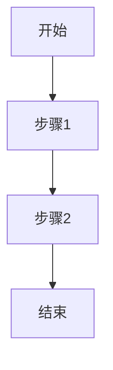

# [需求名称]

> **需求编号**: [编号]
> **优先级**: [P0/P1/P2]
> **需求类型**: [产品/技术]
> **状态**: [待评审/进行中/已完成/已废弃]

---

## 一、背景与目标

### 1.1 背景
<!-- 
为什么需要做这个需求？
- 当前存在的问题是什么？
- 用户痛点是什么？
- 业务价值是什么？
-->

[在此处描述背景]

### 1.2 目标
<!--
期望达到什么效果？
- 可量化的指标（如：准确率提升到95%）
- 用户体验提升（如：操作步骤从5步减少到3步）
- 业务目标（如：转化率提升10%）
-->

**核心目标**:
- [目标1]
- [目标2]

**成功指标**:
- [可量化的指标1]
- [可量化的指标2]

---

## 二、参考资源

### 2.1 产品资料
- 产品需求文档: [./产品/产品需求.md]
- UI原型图: [./产品/原型图.png]
- 交互流程图: [./产品/流程图.md]

### 2.2 技术资料
- 相关代码: `类名#方法名`（路径：`src/.../Xxx.java`）
- 架构设计: [./设计/架构图.md]
- 数据库表: `表名`（路径：`db/...`）

### 2.3 测试反馈
- 测试问题文档: [./测试/测试问题.md]
- 用户反馈: [链接或文档]

---

## 三、验收标准

> **必须可验证、可量化、可测试**
> **审核原则**：对照本章节逐项检查，任何一项不通过则需求未完成

### 3.1 功能验收（P0必过）
| 序号 | 验收项 | 验证方式 | 预期结果 | 状态 |
|------|--------|---------|---------|------|
| F-001 | `[具体功能1]` | `[测试步骤]` | `[预期输出]` | [ ] |
| F-002 | `[具体功能2]` | `[测试步骤]` | `[预期输出]` | [ ] |
| F-003 | `[具体功能3]` | `[测试步骤]` | `[预期输出]` | [ ] |

### 3.2 性能验收（P1必过）
| 序号 | 性能项 | 指标要求 | 测试方法 | 状态 |
|------|--------|---------|---------|------|
| P-001 | 响应时间 | `<X秒` | 压测工具 | [ ] |
| P-002 | 并发能力 | `>X QPS` | 压测工具 | [ ] |

### 3.3 质量验收（P0必过）
| 序号 | 质量项 | 检查标准 | 检查方式 | 状态 |
|------|--------|---------|---------|------|
| Q-001 | IDE警告 | 0个警告 | IDE检查 | [ ] |
| Q-002 | 代码覆盖 | >80% | 单元测试报告 | [ ] |
| Q-003 | 代码规范 | 符合RULE_SPEC.md和coding-standard.md | 对照检查 | [ ] |

---

## 四、详细需求

### 4.1 [功能模块1]

#### 输入
<!-- 描述该功能的输入数据 -->
- 输入字段1: [类型，是否必填，示例值]
- 输入字段2: [类型，是否必填，示例值]

#### 处理逻辑
<!-- 详细描述处理逻辑 -->
1. [步骤1]
2. [步骤2]
3. [步骤3]

#### 输出
<!-- 描述该功能的输出数据 -->
- 输出字段1: [类型，示例值]
- 输出字段2: [类型，示例值]

#### 异常处理
- 异常场景1: [处理方式]
- 异常场景2: [处理方式]

---

### 4.2 [功能模块2]

#### 输入
#### 处理逻辑
#### 输出
#### 异常处理

---

## 五、技术方案

### 5.1 整体架构
<!-- 可选：如果涉及架构调整，在此描述 -->

### 5.2 核心流程

### 5.3 接口变更
<!-- 如果有接口变更，在此列出 -->

| 接口 | 变更类型 | 变更内容 |
|------|---------|---------|
| /api/xxx | 新增/修改/删除 | 描述 |

---

## 六、风险评估

| 风险点 | 风险等级 | 应对措施 |
|--------|---------|---------|
| [风险1] | [高/中/低] | [应对措施] |
| [风险2] | [高/中/低] | [应对措施] |

---

## 七、变更历史

| 日期 | 版本 | 变更内容 | 变更人 | 审批人 |
|------|------|---------|-------|-------|
| YYYY-MM-DD | v1.0 | 初始版本 | [姓名] | [姓名] |
| YYYY-MM-DD | v1.1 | [修改内容简述] | [姓名] | [姓名] |

---

## 八、AI执行清单

> **核心原则**：继承→复用→检查→沉淀→配合
> **参考文档**：`.iflow/endPoint.md`、`.iflow/context/rule/RULE_SPEC.md`、`.iflow/context/rule/coding-standard.md`、`.iflow/context/experience/collaboration-method.md`

### Phase 1: 准备（必读）
- [ ] 读取本需求文档
- [ ] 读取requirementColdStart.md
- [ ] 读取关联的技术资料（代码位置、数据库表）
- [ ] 确认验收标准（是否可验证、可量化）

### Phase 2: 实现（遵循规范）
- [ ] **联动检查**：修改前检查关联节点/代码/文件，详见`.iflow/context/experience/collaboration-method.md`
- [ ] **代码实现**：遵循`.iflow/context/rule/coding-standard.md`规范，禁止违反任何规则
- [ ] **单元测试**：核心逻辑覆盖率>80%
- [ ] **文档更新**：Javadoc完整，注释清晰

### Phase 3: 验证（对照验收标准）
- [ ] **功能验证**：对照"三、验收标准"逐项验证
- [ ] **性能验证**：对照性能标准验证
- [ ] **质量验证**：消除IDE警告，代码无冗余

### Phase 4: 沉淀（避免重复犯错）
- [ ] 更新requirementColdStart.md（记录新发现）
- [ ] 如有通用经验，更新`.iflow/context/experience/`目录
- [ ] 如有问题，更新`.iflow/context/issues/`目录

### Phase 5: 交付
- [ ] 更新需求文档状态为"已完成"
- [ ] 补充代码链接到"代码/代码映射.md"
- [ ] 更新变更历史

---

**注意事项**:
1. 本文档创建后，必须在同级目录下创建`requirementColdStart.md`
2. 所有`[xxx]`标记的内容必须替换为实际值
3. 验收标准必须可验证、可量化
4. 代码链接必须到类/方法级别
5. AI执行时必须严格遵循"八、AI执行清单"
6. 验收时对照"三、验收标准"表格逐项检查

**审核纠错**:
- 需求完成后，对照验收标准表格审核
- 任何一项不通过，需返回修改
- 审核结果记录到变更历史
